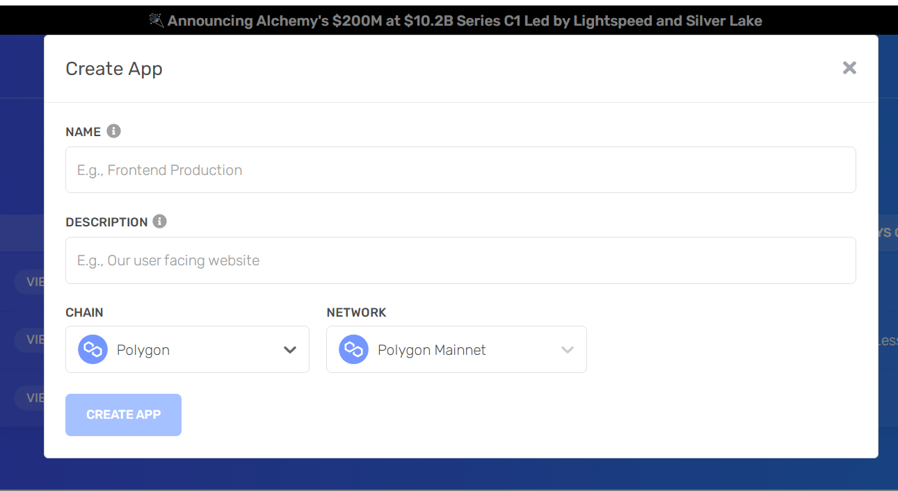
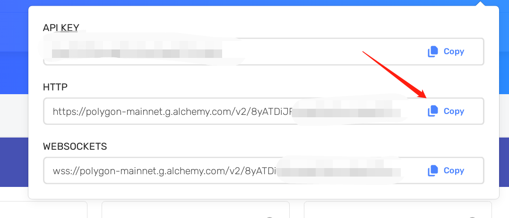
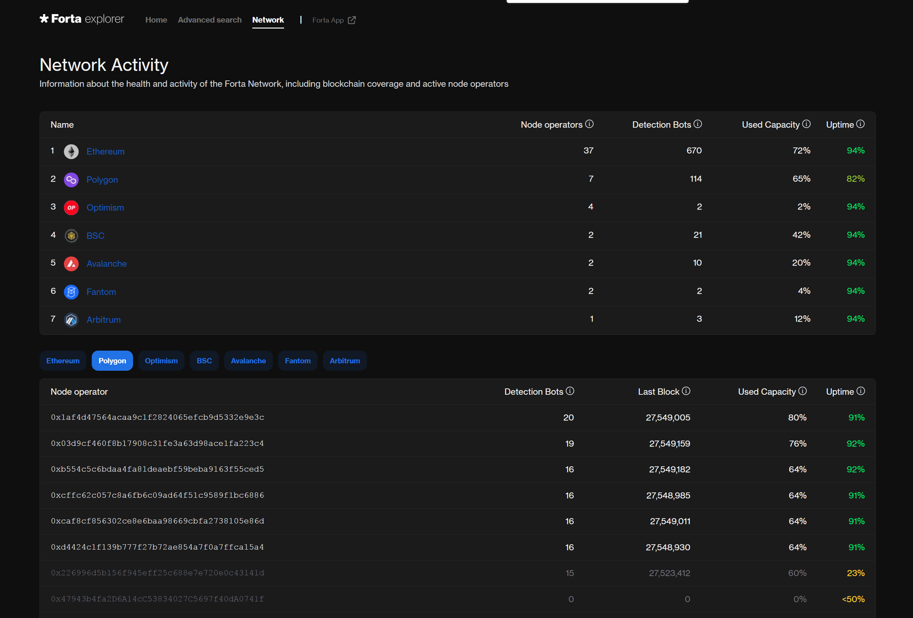
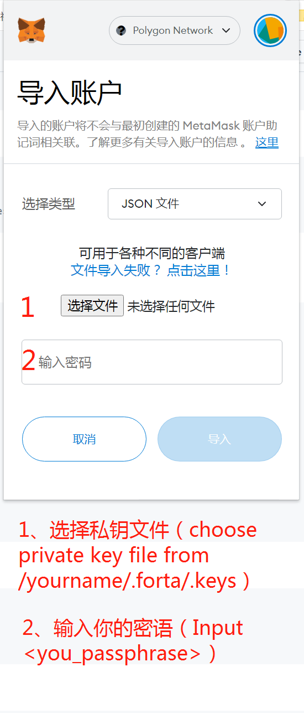

# Forta 测试网 (Forta testnet)

## 扫描节点配置要求（Scan Node Requirements）

- 以下是运行 Forta 扫描节点的要求（The following are the requirements for running a Forta scan node）

- Liunx 64 位发行版 （ 64-bit Linux distribution）
- CPU 4+核 （CPU with 4+ cores）
- 16GB 内存（16GB RAM）
- 能够连接互联网（Connection to Internet）
- Docker v20.10+
- 100GB SSD 硬盘 100GB SSD (in addition to full node requirements)
- **推荐（Recommended）:** 全节点（任何链）（Full node (any chain)）

## 安装步骤（Installation steps）

- 安装 Docker（Install Docker）

```bash
sudo apt update
curl -fsSL https://get.docker.com -o get-docker.sh
sh get-docker.sh
sudo systemctl status docker
```

- 配置 Docker（Configure Docker）
- 添加一个名为`daemon.json`到`/etc/docker`目录的文件，其内容如下（Add a file called `daemon.json` to your `/etc/docker` directory with the following contents）：

```bash
{    "default-address-pools": [
        {
            "base":"172.17.0.0/12",
            "size":16
        },
        {
            "base":"192.168.0.0/16",
            "size":20
        },
        {
            "base":"10.99.0.0/16",
            "size":24
        }
    ]
}
```

- 重启 Docker(Restart Docker)

```bash
sudo systemctl restartdocker
```

- 安装 Forta（ Install Forta）

```bash
sudo curl https://dist.forta.network/artifacts/forta -o /usr/local/bin/forta
```

- 赋予执行权限（Make the binary executable）

```bash
sudo chmod 755 /usr/local/bin/forta
```

- 初始化设置（Initial Setup）
- 初始化 Forta 使用`forta init`命令(Initialize Forta using the `forta init` command):

```bash
forta init --passphrase <your_passphrase>
```

这会生成一个配置目录，一个私钥，并输出你的 Scan 地址（This generates a config directory, a private key, and output your address）：

```bash
#如下例(for example)
Scanner address: 0xAAA8C491232cB65a65FBf7F36b71220B3E695AAA

Successfully initialized at /yourname/.forta
```

- 配置目录位置（config directory location）：`/yourname/.forta`
- 私钥位置（private key josn-file location）:`/yourname/.forta/.keys`

- 注册 polygon mainnet api key 通过[alchemy](https://www.alchemy.com/)
  
  
  
  
  
- 配置 config.yml（Configure config.yml）
- 例如扫描 Polygon 主网（Eg:Scan Polygan mainnet）

```bash
chainId: 137

# The scan settings are used to retrieve the transactions that are analyzed
scan:
  jsonRpc:
    url: http://your-polygon-node

# The trace endpoint must support trace_block (such as alchemy)
trace:
  enabled: false

```

- 替换 http://your-polygon-node 为你注册的 alchemy 的 HTTP address(Replace http://your-polygon-node with alchemy http address)

- 1.为你的 Scan node 节点注入资金（fund your scan node address）
- 您需要使用一些 Polygon（主网）MATIC 为您的扫描节点地址提供资金，以便能够发送此交易。 你可以使用 metamask 钱包给扫描节点地址转账 1 个 MATIC(You need to fund your scan node address with some Polygon (Mainnet) MATIC to be able to send this transaction.You can use Metamask transfer 1 MATIC to scan node address .)
- 查看扫描节点地址（find out your scan node address command）

```bash
forta account address
```

- 2.注册你的节点到合约中（register your node to the registry contract）

```bash
forta register --owner-address <owner-address> --passphrase <passphrase>
#owner-address不是scan node address 这里使用你metamask钱包地址
#（(owner-address not you scan node address，You can use metamask wallet address）
```

- 配置系统启动服务(Configure systemd)
- 替换<your_passphrase>（Replace you passphrase）

```bash
echo "[Unit]
Description=Forta
After=network.target
[Service]
Environment="FORTA_DIR=/root/.forta"
Environment="FORTA_PASSPHRASE=<your_passphrase>"
User=root
Type=simple
ExecStart=forta run
Restart=on-failure
LimitNOFILE=4096
[Install]
WantedBy=multi-user.target" > /etc/systemd/system/fortad.service
```

- 启动服务（Enable service and start）

```bash
sudo systemctl daemon-reload
sudo systemctl enable fortad
sudo systemctl start fortad
```

- 查看日志（view logs）：

```bash
journalctl -u fortad -f
```

- 查看 forta 运行状态（check forta status）：

```bash
forta status
```

## 查看节点状态通过 Forta explorer（Check status through Forta explorer）

[Forta explorer](https://explorer.forta.network/network)


## [可选]扫描节点地址导入 Metamask 钱包([optional] Import Scan node address to Metamask)



- 然后填写 forta email 中的表单等待节点加入验证，部署完毕，祝好运！（Then fill the form from latest forta email waiting for nodes to authorized,Good luck!）
